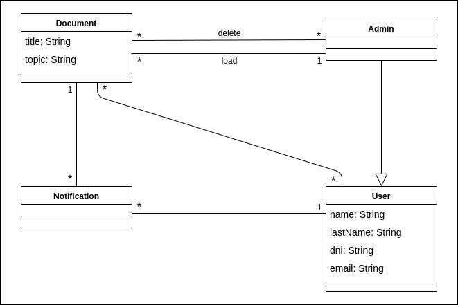

# Software Requirements Specification
## For <notifications>

Version 0.1

Prepared by <author Sosa Juan, Imenzon Carlos, Fernandez Federico>

<organization>  
	
<date created> 

Tabla de contenidos
====================
* [Revision del historial](#revision-del-historial)
* 1 [Introduccion](#1-introduccion)
  * 1.1 [Proposito del documento](#11-Proposito-del-documento)
  * 1.2 [Alcance del producto](#12-Alcance-del-producto)
  * 1.3 [Definiciones, Acronimos y Abreviaciones](#13-definiciones-acronimos-y-abreviaciones)
  * 1.4 [Referencias](#14-referencias) 
  * 1.5 [Vision global](#15-vision-global)
* 2 [Descripcion global](#2-descripcion-global)
  * 2.1 [Perspectiva del documento](#21-perspectiva-del-producto)
  * 2.3 [Restricciones Generales](#23-restricciones-generales)
  * 2.4 [Suposiciones y dependencias](#24-suposiciones-y-dependencias)
* 3 [Requerimientos Especificos](#3-requerimientos-especificos) 
  * 3.1 [Requerimientos de interfaz externa](#31-requerimientos-de-interfaz-externa)
  * 3.2 [Requerimientos Funcionales](#32-requerimientos-Funcionales)
  * 3.3 [Requerimientos de Desempeño]( #33-requerimientos-de-Desempeño)
  * 3.4 [Restricciones de diseño](#34-restricciones-de-diseño)
  * 3.5 [Atributos](#35-atributos)

## Revision del historial
| Nombre | Fecha   | Razon del cambio    | Version   |
| -------| ------- | ------------------- | --------- |
|        |         |                     |           |
|        |         |                     |           |
|        |         |                     |           |

## 1. Introduccion
Este documento es una especificacion de requerimientos de sofware para el sistema de notificaciones . En este documento se definirá el alcance del sistema y una descripcion especifica de los requerimientos.

### 1.1 Proposito del documento
Facilitar el acceso a los usuarios a un documento de manera instantanea y simple.

### 1.2 Alcance del producto
El presente documento describe detalladamente la arquitectura y los requerimientos del sistema, el proposito del proyecto es la creacion de una aplicacion con la finalidad de notificar a un usuario que tiene un documento que lo referencia y
ademas facilitarle la tarea al/los administrador/es de enviar el documento.

### 1.3 Definiciones, Acronimos y Abreviaciones
La forma de interactuar en el sistema sera de la siguiente manera:
Los TAGGED solo podran acceder a los documentos en los cuales son referenciado y no podran crear otros usuario, en cambio, los ADMIN podran cargar documentos y crear nuevos usuarios.

### 1.4 Referencias
* SRS: https://github.com/jam01/SRS-Template

### 1.5 Vision global
El objetivo de este proyecto es facilitar la comunicacion entre la UNRC y todas las personas que usen el sistema SIAL, a traves de la aplicacion NOTIFICATIONS. La aplicacion va a enviar una notificacion al usuario de que lo han nombrado en un documento, ya sea porque el haya solicitado el documento o simplemente se le haya nombrado para comunicarle algo.

## 2. Descripcion global

### 2.1 Perspectiva del documento
La aplicación NOTIFICATIÓNS sera un producto diseñado para la Universidad Nacional de Rio Cuarto, en el cual, se utilizara para comunicarle a sus usarios que un documento se encuentra disponible. 

### 2.2 Funcionalidad del producto
NOTIFICATIONS tendra dos tipos de usuarios, administrador el cual se encargara de subir o crear el documento para el usuario estandar.
El usuario estandar sera el que usara la aplicacion y podra ver el documento enviado por el administrador. Para que el usuario pueda 
ver las notificaciones es necesario que tenga la aplicacion instalada en el celular y tener datos o estar conectado a una red Wi-Fi.

### 2.3 Restricciones Generales
* Debe utilizar conexión a internet.
* Debe poseer un mail.
* El sistema se diseñara según el modelo cliente/servidor.
* Lenguajes y tecnologías en uso: RUBY, JAVASCRIPT, SQL, HTML.

### 2.4 Suposiciones y dependencias
* No poseer una conexión a internet.
* No poseer un mail sincronizado con la UNRC.
* Base de datos de la UNRC.

## 3 Requerimientos Especificos

### 3.1 Requerimientos de interfaz externa
En esta sección especificaremos aquellos requisitos que intervienen en el proceso de desarrollo del software como por ejemplo que interfaz le gustaría al usuario

### 3.2 Requerimientos Funcionales
* Registrarse: El usuario deberá proporcionar un nombre, una contraseña, un mail y deberá
  proporcionar acceso a los datos personales del SIAL.
* Inicio de Sesión: Un usuario registrado deberá ser capaz de ingresar a la aplicación.
* Cerrar Sesion: El usuario debe poder cerrar seccion de la aplicacion. 
* Recuperar Contraseña: El usuario registrado deberá ser capaz de recuperar la contraseña
  utilizando el correo registrado.
* Estado del Documento: El ususario debera poder verificar el estado del documento solicitado.
* Descargar Documentos: El usuario debera ser capaz de descargar documentos.
* Subir Documento: El usuario administrador debe poder realizar la carga de un documento.
* Visualizacion del Documento: El usuario debera poder visualizar los documentos propios y publicos. 

  

### 3.3 Requerimientos de Desempeño

### 3.4 Restricciones de Diseño

### 3.5 Atributos

